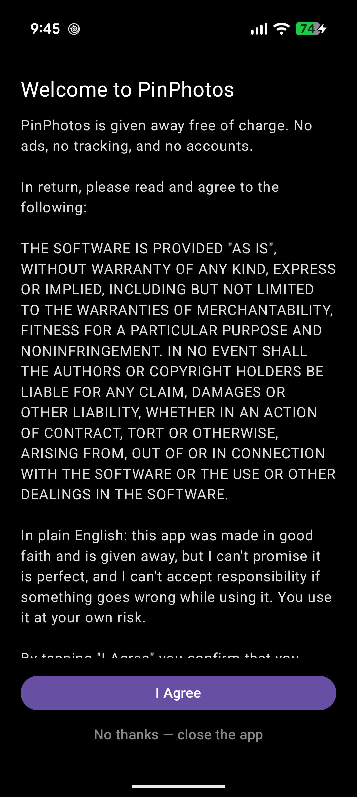
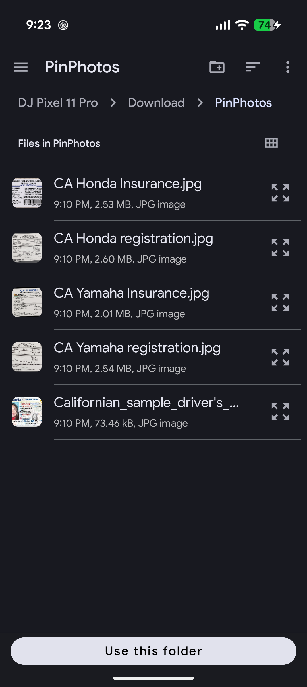
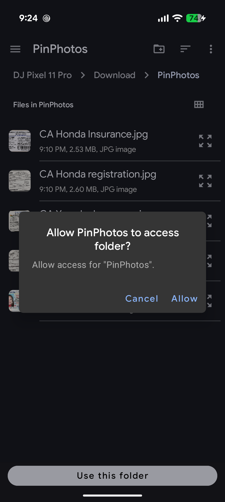
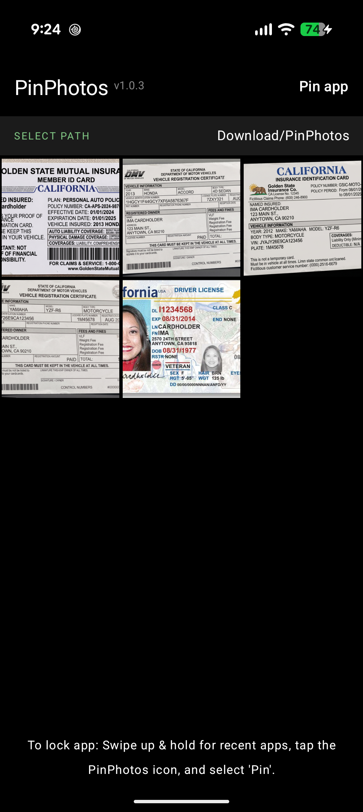
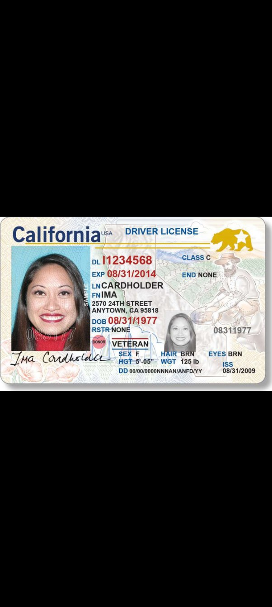
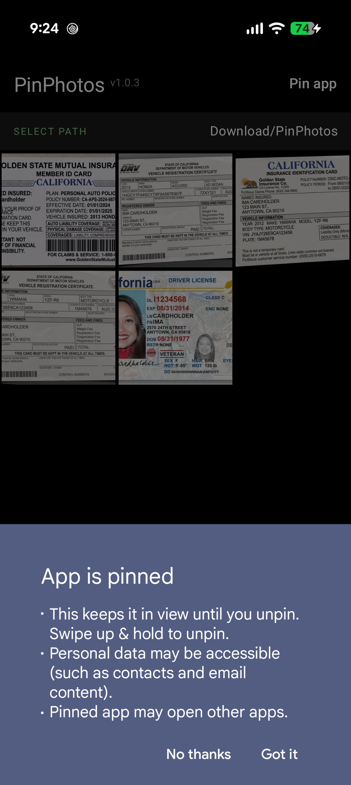
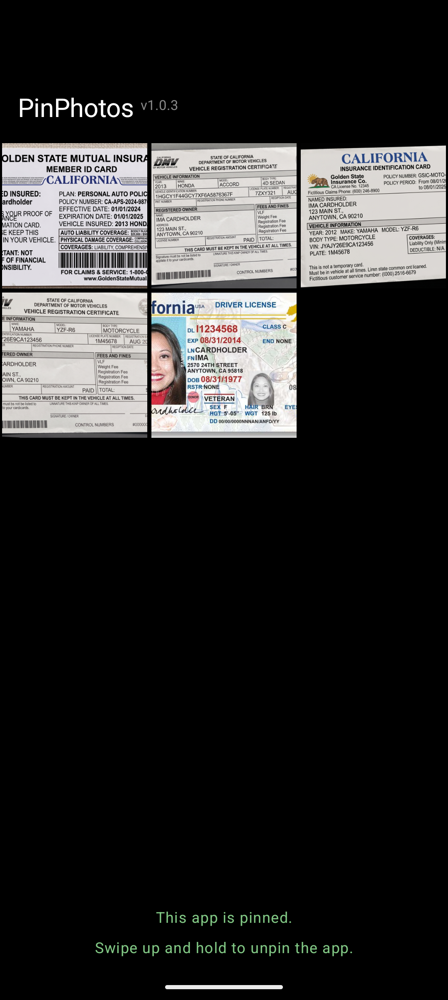
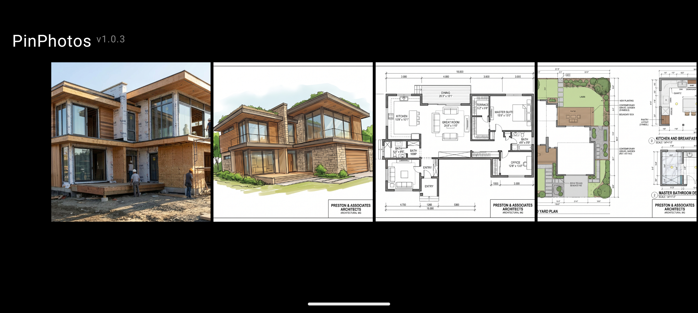

# PinPhotos
An Android app that securely locks your screen to a single photo folder.

*Google Play Store link: Not yet released...*

---

## Full Description:

Handing your unlocked phone to a stranger—or even a friend—can be incredibly nerve-wracking. PinPhotos eliminates that anxiety by locking your device to a single folder of photos, ensuring no one can snoop through your messages, apps, or other private data.

Whether you need to hand your phone to a police officer to show your digital insurance and registration, or you want to pass a device around to customers to show a portfolio without them wandering into your personal gallery, PinPhotos keeps your device secure. By leveraging Android's native app pinning, the person holding your phone cannot navigate away, hit the home button, or open other apps without your device's lock screen PIN, pattern, or fingerprint.

Key Features:

৹ Total Lockdown: Pins the app to your screen so users cannot exit without your device password.  

৹ Folder Specific: Choose exactly which folder of images to display—and nothing else.  

৹ No Screenshots Allowed: Built-in security prevents the app from appearing in the recent apps preview and blocks screenshots entirely.  

৹ 100% Offline & Private: Zero internet permissions requested. Absolutely no data is collected, tracked, or shared.  

৹ Ad-Free & Account-Free: A completely clean, distraction-free experience with no sign-ups required.  

---

## How to Create a Photo Folder for PinPhotos

Follow these steps to build a dedicated folder using the built-in Android **Files** app:

1. Open the **Files** app on your Android device.
2. Tap **Images** under the *Categories* section.
3. Select the photos you want to include in your PinPhotos folder.
4. Tap the **three-dot menu** (⋮) in the top-right corner.
5. Choose **Copy to** from the dropdown menu.
6. Navigate to your desired storage location (e.g., **Pictures**).
7. Tap **New folder** at the bottom of the screen.
8. Name your folder (e.g., "PinPhotos").
9. Tap **Copy to folder** to finish.

**You're all set!** Open PinPhotos, tap **Select Path**, and point it to your newly created folder.

> **⚠️ Note:** Since this process *copies* your photos rather than moving them, you'll end up with duplicates—your originals stay put, and a second copy lives in the new folder. Keep in mind:
> - If you delete or move the photos in your PinPhotos folder later, they won't show up in the app anymore.
> - Duplicates take up extra storage space, so periodically clean out old PinPhotos folders you no longer need.

---

## How to Exit PinPhotos

Since PinPhotos uses Android's native app pinning to lock your screen, exiting works the same way you'd unpin any app.

**If your phone uses Gesture Navigation** (*most modern Android phones*):
**Swipe up and hold** from the bottom of the screen, then confirm with your PIN, pattern, or fingerprint.

> **📌 Note:** Exact steps to unpin can vary if your device uses **button navigation** (a Back/Home/Recent Apps button layout) instead of gestures. Not sure which you have? **The first time you pin any app**, Android will briefly show on-screen instructions for how to unpin it—pay attention to that message, as it's tailored to your specific device and navigation style.

---

## Requirements & Compatibility

- **Minimum OS:** Android 9.0 (Pie) or higher
- **Navigation:** Works with both gesture and button navigation (see [How to Exit PinPhotos](#how-to-exit-pinphotos) above for details)

### Permissions Used

PinPhotos does **not** request broad storage or media permissions. Instead, it uses Android's built-in folder picker (Storage Access Framework), which means:

- You choose the exact folder you want PinPhotos to access.
- Android grants read access to **only that specific folder**—nothing else on your device.
- No manifest permissions are required, and no system popup asking to "access all photos" or "access all files" ever appears.

This design keeps PinPhotos true to its privacy-first goal: it only sees what you explicitly show it.

---

## Troubleshooting / FAQ

**Q: I picked a folder, but no photos are showing up.**
A: Double-check that the folder you selected actually contains images (not just subfolders). PinPhotos only displays photos directly inside the chosen folder.

**Q: My photos disappeared from PinPhotos after I organized my gallery.**
A: If you deleted, moved, or renamed the original folder (or the photos inside it), PinPhotos won't be able to find them anymore. Simply re-select the folder using **Select Path** to refresh the connection.

**Q: Can I change which folder PinPhotos uses later?**
A: Yes! Open PinPhotos, tap **Select Path**, and choose a new folder at any time.

**Q: Why can't I take a screenshot while using PinPhotos?**
A: This is intentional. Screenshot blocking is a built-in privacy feature so the person holding your phone can't secretly capture and keep images from your gallery.

**Q: The app won't pin / "Pin app" option is missing.**
A: App pinning must be enabled on your device first:
1. Go to **Settings > Security & Privacy**
2. Go to **More security & privacy**
3. Find **App Pinning**
4. Toggle it **On**

**Q: I can't exit the app / nothing happens when I try to unpin.**
A: See the [How to Exit PinPhotos](#how-to-exit-pinphotos) section above. If you're unsure whether your device uses gesture or button navigation, check **Settings > System > Gestures**.

**Q: I'm still stuck—where can I find more help with app pinning?**
A: Check out [Google's official guide on app pinning](https://support.google.com/android/answer/9455138) for additional device-specific instructions.

---

## Screenshots

### Getting Started

  
  
  

### Viewing Your Photos

  
  

### Locked & Secure

  
  
  

